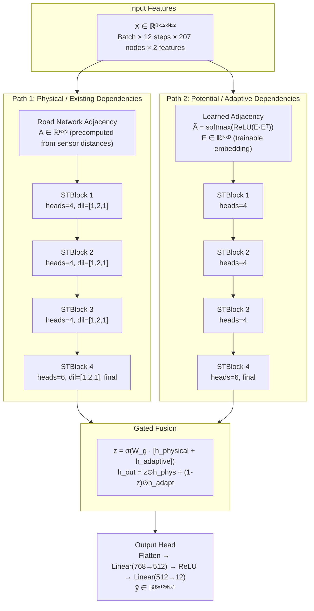

# STGAT: Spatial-Temporal Graph Attention Networks
## for Traffic Flow Forecasting

> **Paper:** Xiangyuan Kong, Weiwei Xing, Xiang Wei, Peng Bao, Jian Zhang, Wei Lu — IEEE Access, 2020
> **Implementation:** Diwas Shrestha, Manasi Acharya, Amit Gupta, Tushar Parihast, Shristy Koirala

---

<!-- ============================================================ -->
<!-- SLIDE 1: PROBLEM & MOTIVATION                                -->
<!-- ============================================================ -->

## 1. The Traffic Forecasting Problem

### Why This Matters

Traffic congestion costs cities billions annually in lost productivity, fuel waste, and environmental damage. Accurate traffic forecasting enables:

- **Intelligent Transportation Systems (ITS)** — adaptive traffic signal control
- **Route planning** — real-time navigation and re-routing
- **Urban planning** — infrastructure investment decisions
- **Emission reduction** — optimizing traffic flow reduces idle time

### The Core Challenge

```
┌─────────────────────────────────────────────────────────────────┐
│                    TRAFFIC FORECASTING TASK                      │
│                                                                  │
│   GIVEN:  Historical speed readings from N road sensors          │
│           over the past H time steps                             │
│                                                                  │
│   PREDICT: Future speed readings for all N sensors               │
│            over the next F time steps                            │
│                                                                  │
│   ┌──────────────────────┐         ┌──────────────────────┐     │
│   │  Input: [12, N, 2]  │   →    │ Output: [12, N, 1]   │     │
│   │  12 past steps       │         │  12 future steps      │     │
│   │  N = 207 sensors     │         │  N = 207 sensors      │     │
│   │  2 features:         │         │  1 value: speed (mph) │     │
│   │   • speed            │         │                        │     │
│   │   • time-of-day      │         │                        │     │
│   └──────────────────────┘         └──────────────────────┘     │
│                                                                  │
│   Horizon: 5min intervals → predict 1 hour into the future      │
└─────────────────────────────────────────────────────────────────┘
```

### Two Intertwined Dependencies

Traffic data exhibits dependencies in **two orthogonal dimensions**:

```
                    SPATIAL (Space)
                    ────────────────
                    Sensor A ←→ Sensor B
                         │  road network
                         │  topology
                         │
                    ─────┼────────────────
                    TEMPORAL (Time)
                    ────────────────
                    t-12 → t-11 → ... → t → t+1 → ... → t+12
                         │
                         │  rush hour patterns
                         │  speed transitions
```

**Key insight:** These dependencies are NOT independent — a traffic jam at sensor A at time t propagates to sensor B at time t+k. This is the **spatio-temporal coupling** problem.

---

<!-- ============================================================ -->
<!-- SLIDE 2: RELATED WORK LANDSCAPE                               -->
<!-- ============================================================ -->

## 2. Evolution of Traffic Forecasting Methods

```
┌──────────────────────────────────────────────────────────────────────────┐
│                     METHODOLOGICAL EVOLUTION                              │
│                                                                           │
│  ┌──────────────┐    ┌──────────────┐    ┌──────────────────────────────┐ │
│  │  Classical   │    │   Deep       │    │   Graph Neural               │ │
│  │  Time Series │ →  │   Learning   │ →  │   Networks                   │ │
│  │              │    │              │    │                              │ │
│  │  • ARIMA     │    │  • RNN/LSTM  │    │  • DCRNN (diffusion conv)   │ │
│  │  • VAR       │    │  • Seq2Seq   │    │  • STGCN (spectral conv)    │ │
│  │  • Kalman    │    │  • WaveNet   │    │  • GraphWaveNet (adaptive)  │ │
│  │              │    │              │    │  • STGAT ← THIS WORK        │ │
│  └──────────────┘    └──────────────┘    └──────────────────────────────┘ │
│                                                                           │
│   Limitations of prior GNN approaches:                                    │
│   ┌─────────────────────────────────────────────────────────────────┐    │
│   │  DCRNN  │ Fixed diffusion kernel; RNN-based → slow training     │    │
│   │  STGCN  │ Fixed Laplacian; can't capture dynamic correlations   │    │
│   │  GWave  │ Adaptive adj, but uses fixed convolution weights      │    │
│   │  STGAT  │ ✓ Attention learns dynamic weights                    │    │
│   │         │ ✓ Dual-path captures both explicit + latent structure │    │
│   │         │ ✓ Inductive — generalizes to unseen graphs            │    │
│   └─────────────────────────────────────────────────────────────────┘    │
└──────────────────────────────────────────────────────────────────────────┘
```

### Why Graph Attention?

| Approach | Spatial Modeling | Limitation |
|----------|-----------------|------------|
| GCN (Spectral) | `D^(-1/2) A D^(-1/2)` — fixed Laplacian | Static weights; transductive only |
| GAT (Attention) | `α_ij = softmax(LeakyReLU(a[Wh_i ‖ Wh_j]))` | Learns dynamic importance per edge |
| STGAT's GAT | Above + adjacency-weighted log-scores | Combines topology prior with learned attention |

---

<!-- ============================================================ -->
<!-- SLIDE 3: STGAT ARCHITECTURE OVERVIEW                          -->
<!-- ============================================================ -->

## 3. STGAT: High-Level Architecture

### The Dual-Path Design

The core innovation of STGAT is the **parallel processing of two spatial dependency types**:



### Why Two Paths?

| Path | Adjacency Source | Captures |
|------|-----------------|----------|
| **Physical** | Precomputed road-network distances (Gaussian kernel) | Known topology: connected roads, proximity-based influence |
| **Adaptive** | Learned embedding similarity: `softmax(ReLU(E·Eᵀ))` | Hidden correlations: distant nodes that co-vary (e.g., parallel arterials, commuter corridors) |

The **gated fusion** learns to balance these two signals per node and per time step.

---

<!-- ============================================================ -->
<!-- SLIDE 4: GRAPH ATTENTION — SPATIAL MODELING                   -->
<!-- ============================================================ -->

## 4. Spatial Dependency: Multi-Head Graph Attention

### Single Attention Head

For each node `i` and its neighbors `j ∈ N(i)` (defined by the adjacency matrix):

```
                    ATTENTION COEFFICIENT COMPUTATION
                    ──────────────────────────────────

    Node features h_i, h_j ∈ ℝᶜ (c = hidden channels)

    Step 1: Linear projection
            h_i' = W · h_i          where W ∈ ℝᶜˣᶜ

    Step 2: Attention scores (additive form)
            e_ij = LeakyReLU( a_srcᵀ · h_i'  +  a_dstᵀ · h_j' )
                                ↑source score        ↑dest score

            This is more expressive than dot-product attention:
            it separately parameterizes source and destination roles.

    Step 3: Adjacency-weighted logits
            e_ij = e_ij + log(A_ij + ε)      ← incorporate topology prior

            e_ij = -∞   where A_ij = 0       ← mask non-neighbors

    Step 4: Softmax normalization over neighbors
            α_ij = ────────── exp(e_ij) ──────────
                    Σ_{k∈N(i)} exp(e_ik)

    Step 5: Weighted aggregation
            h_i'' = Σ_{j∈N(i)} α_ij · h_j'

    Step 6: Residual + bias
            h_i_out = h_i'' + b + h_i          ← skip connection
```

### Multi-Head Extension

```
    ┌──────────┐  ┌──────────┐       ┌──────────┐
    │  Head 1  │  │  Head 2  │  ...  │  Head K  │    K = 4 or 6
    │  α_ij¹   │  │  α_ij²   │       │  α_ijᴷ   │
    └────┬─────┘  └────┬─────┘       └────┬─────┘
         │              │                  │
         ▼              ▼                  ▼
    ┌─────────────────────────────────────────────┐
    │                                             │
    │   IF intermediate block (concat=True):      │
    │     h_out = ELU( [head₁ ‖ head₂ ‖ ... ‖ head_K] )
    │     dim: K × c
    │                                             │
    │   IF final block (concat=False):            │
    │     h_out = (head₁ + head₂ + ... + head_K) / K
    │     dim: c
    │                                             │
    └─────────────────────────────────────────────┘
```

### Numerical Stability Note

All attention score computations are cast to **float32** internally, even when the model runs in float16 mixed precision. This prevents the notorious problem of `softmax(very_large_or_small_values)` producing NaN in half-precision. The output is cast back to the model's working dtype.

---

<!-- ============================================================ -->
<!-- SLIDE 5: GATED TEMPORAL CONVOLUTION                           -->
<!-- ============================================================ -->

## 5. Temporal Dependency: Gated Temporal Convolution

### Motivation: Why Not RNNs?

RNNs (LSTM/GRU) for temporal modeling suffer from:
- **Sequential bottleneck** — cannot parallelize over time
- **Vanishing gradients** over long sequences
- **Slow training** compared to convolutional approaches

STGAT instead uses **gated 1D convolutions**, inspired by WaveNet's gated activation and STGCN's temporal convolution blocks.

### Gated Temporal Convolution Block (GTCN)

```
    INPUT: X ∈ ℝᴮˣᵀˣᴺˣᶜ     (Batch, Time=12, Nodes=207, Channels=64)
           │
           ▼ Permute to [B, C, T, N] for Conv2d
           │
    ┌──────┴──────────────────┐
    │                         │
    ▼                         ▼
    ┌──────────────┐    ┌──────────────┐
    │  Filter Conv │    │   Gate Conv  │
    │  Conv2d      │    │   Conv2d     │
    │  kernel=(2,1)│    │   kernel=(2,1)│
    │  dilation=d  │    │   dilation=d │
    │  pad=(d,0)   │    │   pad=(d,0)  │
    │              │    │              │
    │  ┌────────┐  │    │  ┌────────┐  │
    │  │ CAUSAL │  │    │  │ CAUSAL │  │
    │  │ PADDING│  │    │  │ PADDING│  │
    │  └────────┘  │    │  └────────┘  │
    └──────┬───────┘    └──────┬───────┘
           │                   │
           ▼ tanh()            ▼ sigmoid()
         filter               gate ∈ [0,1]
           │                   │
           └──────┬────────────┘
                  │
                  ▼
         ┌────────────────────┐
         │  Gated Output:     │
         │  out = gate ⊙ filter       ← element-wise
         └────────────────────┘
                  │
                  ▼
         ┌────────────────────┐
         │  Gated Residual:   │
         │  residual = Conv2d │         ← 1×1 conv on UNPADDED input
         │            1×1     │            (bypasses dilated padding)
         │                    │
         │  out = gate⊙filter │
         │      + (1-gate)⊙   │
         │        residual    │
         └────────────────────┘
                  │
                  ▼ ReLU → BatchNorm2d
                  │
                  ▼
            OUTPUT: same shape as input
```

### Causal Padding

```
    TIME AXIS (left = past, right = future):
    
    Without padding:           With causal padding (left-only):
    ┌─┬─┬─┬─┬─┐               ┌─┬─┬─┬─┬─┬─┬─┐
    │t₀│t₁│t₂│t₃│t₄│          │0│0│t₀│t₁│t₂│t₃│t₄│
    └─┴─┴─┴─┴─┘               └─┴─┴─┴─┴─┴─┴─┘
                                ↑ pad_left = (kernel_size-1) * dilation
    
    Ensures output at time t depends ONLY on times ≤ t (no future leakage).
    This is critical: the model must never peek at future traffic states.
```

### Dilated Convolution Stack

```
    Layer 1 (dilation=1):    ●───●───●───●───●     receptive field: 2 steps
    Layer 2 (dilation=2):    ●───────●───────●     receptive field: 4 steps  
    Layer 3 (dilation=1):    ●───●───●───●───●     receptive field: 5 steps
    
    Total receptive field covers 5 of 12 input steps per block.
    Stacking 4 blocks → hierarchical temporal feature extraction.
```

---

<!-- ============================================================ -->
<!-- SLIDE 6: SPATIO-TEMPORAL BLOCK                                -->
<!-- ============================================================ -->

## 6. The Spatio-Temporal Block (STBlock)

Each STBlock sandwiches spatial attention between temporal convolutions:

```
    ┌─────────────────────────────────────────────────────────────┐
    │                      STBLOCK (×4 stacked)                    │
    │                                                              │
    │   INPUT: X ∈ ℝᴮˣ¹²ˣᴺˣᶜ                                      │
    │     │                                                        │
    │     ▼                                                        │
    │   ┌──────────────────────────────┐                          │
    │   │  Gated Temporal Conv (dil=1) │  temporal squeeze        │
    │   └──────────────┬───────────────┘                          │
    │                  ▼                                           │
    │   ┌──────────────────────────────┐                          │
    │   │  Gated Temporal Conv (dil=2) │  wider temporal context  │
    │   └──────────────┬───────────────┘                          │
    │                  ▼                                           │
    │   ┌──────────────────────────────┐                          │
    │   │  Gated Temporal Conv (dil=1) │  temporal refine         │
    │   └──────────────┬───────────────┘                          │
    │                  │                                           │
    │                  ▼  reshape [B,T,N,C] → [B·T, N, C]         │
    │   ┌──────────────────────────────┐                          │
    │   │  Multi-Head Graph Attention  │  spatial message-passing │
    │   │  K heads (4 for blocks 1-3,  │                          │
    │   │           6 for block 4)     │                          │
    │   └──────────────┬───────────────┘                          │
    │                  │  reshape [B·T, N, C'] → [B, T, N, C']    │
    │                  ▼                                           │
    │   ┌──────────────────────────────┐                          │
    │   │  Block Residual Connection   │  skip from block input   │
    │   │  (1×1 Linear if dim change)  │                          │
    │   └──────────────┬───────────────┘                          │
    │                  ▼                                           │
    │   ┌──────────────────────────────┐                          │
    │   │  BatchNorm2d + ReLU          │                          │
    │   └──────────────┬───────────────┘                          │
    │                  │                                           │
    │                  ▼  Dropout(p=0.6)                           │
    │   OUTPUT: X' ∈ ℝᴮˣ¹²ˣᴺˣᶜ'                                   │
    └─────────────────────────────────────────────────────────────┘
```

### Block Stacking Configuration

| Block | Attention Heads | Concat? | Output Channels |
|-------|----------------|---------|-----------------|
| 1     | 4              | Yes     | 4 × 64 = 256 (projected back to 64) |
| 2     | 4              | Yes     | 4 × 64 = 256 (projected back to 64) |
| 3     | 4              | Yes     | 4 × 64 = 256 (projected back to 64) |
| 4     | 6              | **No**  | 64 (averaged, no projection needed) |

The ramp-up to 6 heads in the final block provides richer representations before fusion, while averaging (not concatenation) keeps the channel dimension consistent.

---

<!-- ============================================================ -->
<!-- SLIDE 7: DUAL-PATH + ADAPTIVE ADJACENCY                       -->
<!-- ============================================================ -->

## 7. The Two Paths in Detail

### Path 1: Physical Adjacency (Road Network Topology)

```
    ┌─────────────────────────────────────────────────────────────┐
    │                 PHYSICAL PATH                                │
    │                                                              │
    │   Adjacency Matrix Construction:                             │
    │                                                              │
    │   Raw distances between sensors (GPS coordinates):          │
    │   d_ij = haversine(lat_i, lon_i, lat_j, lon_j)              │
    │                                                              │
    │   Gaussian kernel thresholding:                              │
    │   A_ij = exp(-d_ij² / σ²)   if d_ij < threshold             │
    │           0                   otherwise                      │
    │                                                              │
    │   Normalization (optional):                                  │
    │   • Symmetric:  D^(-½) A D^(-½)  (spectral normalization)   │
    │   • Row-stochastic: A / Σ_j A_ij  (mean aggregation)        │
    │   • Raw: as-is (attention learns the scaling)               │
    │                                                              │
    │   Fixed throughout training — encodes "known" road network │
    └─────────────────────────────────────────────────────────────┘
```

### Path 2: Adaptive Adjacency (Learned from Data)

```
    ┌─────────────────────────────────────────────────────────────┐
    │                 ADAPTIVE PATH                                │
    │                                                              │
    │   Learned Node Embeddings:                                   │
    │                                                              │
    │   E ∈ ℝᴺˣᴰ    ← trainable parameter (N=207, D=embed_dim)    │
    │                                                              │
    │   Adaptive Adjacency Matrix:                                 │
    │                                                              │
    │   Ã_raw = ReLU(E · Eᵀ)         ← pairwise embedding dot-product│
    │                                                              │
    │   Ã = softmax(Ã_raw, dim=-1)    ← row-wise normalization      │
    │                                                              │
    │   ┌─────────────────────────────────────────────┐           │
    │   │  INTERPRETATION                             │           │
    │   │                                             │           │
    │   │  If node i and node j have similar          │           │
    │   │  embeddings → high dot product → strong     │           │
    │   │  attention weight → they "communicate"      │           │
    │   │                                             │           │
    │   │  This discovers:                            │           │
    │   │  • Parallel arterial roads                  │           │
    │   │  • Commuter corridor patterns               │           │
    │   │  • Upstream-downstream dependencies         │           │
    │   │    missed by the distance-based graph       │           │
    │   └─────────────────────────────────────────────┘           │
    └─────────────────────────────────────────────────────────────┘
```

### Why Softmax + ReLU?

- **ReLU** ensures non-negative similarities (adjacency weights must be ≥ 0)
- **Softmax** normalizes each row to a probability distribution — this acts as a learned, dense adjacency where every node can theoretically attend to every other node, but the model learns to focus on meaningful relationships
- Unlike the physical path, there is **no thresholding or sparsification** — the model discovers its own sparse structure through gradient descent

---

<!-- ============================================================ -->
<!-- SLIDE 8: GATED FUSION                                         -->
<!-- ============================================================ -->

## 8. Gated Fusion Mechanism

The fusion layer adaptively combines information from both paths:

```
    ┌─────────────────────────────────────────────────────────────┐
    │                     GATED FUSION                             │
    │                                                              │
    │   h_phys ∈ ℝᴮˣ¹²ˣᴺˣ⁶⁴     (Physical path output)           │
    │   h_adap ∈ ℝᴮˣ¹²ˣᴺˣ⁶⁴     (Adaptive path output)           │
    │                                                              │
    │   STEP 1: Project both paths                                 │
    │   ┌──────────────────────────────────────────┐              │
    │   │  p = W_phys · h_phys     ← Linear(64→64) │              │
    │   │  a = W_adap · h_adap     ← Linear(64→64) │              │
    │   └──────────────────────────────────────────┘              │
    │                                                              │
    │   STEP 2: Compute fusion gate                                │
    │   ┌──────────────────────────────────────────┐              │
    │   │  z = σ( W_gate · (h_phys + h_adap) )    │              │
    │   │       ↑ sigmoid ensures z ∈ [0,1]        │              │
    │   └──────────────────────────────────────────┘              │
    │                                                              │
    │   STEP 3: Gated combination                                  │
    │   ┌──────────────────────────────────────────┐              │
    │   │  h_fused = z ⊙ tanh(p) + (1-z) ⊙ tanh(a)│              │
    │   │            ↑ gated physical  ↑ gated adaptive           │
    │   └──────────────────────────────────────────┘              │
    │                                                              │
    │   INTERPRETATION:                                            │
    │   • z ≈ 1.0 → trust physical topology more (e.g., highways) │
    │   • z ≈ 0.0 → trust learned correlations more               │
    │   • z ≈ 0.5 → equal weighting                               │
    │   • Gate is per-element: each node×time can have            │
    │     different fusion weights                                │
    └─────────────────────────────────────────────────────────────┘
```

### Why Gated Fusion (Not Simple Addition or Concatenation)?

| Approach | Limitation |
|----------|-----------|
| **Addition** `h_phys + h_adap` | Equal weight always; cannot adapt per node/time |
| **Concatenation** `[h_phys ‖ h_adap]` | Doubles channels; no selective gating |
| **Gated Fusion** `z⊙p + (1-z)⊙a` | Learns per-element weighting; the gate is **input-dependent** — the model decides based on the data which path to trust more |

---

<!-- ============================================================ -->
<!-- SLIDE 9: OUTPUT PREDICTION HEAD                               -->
<!-- ============================================================ -->

## 9. Output Prediction Head

After fusion, the model must transform hidden representations into speed predictions:

```
    ┌─────────────────────────────────────────────────────────────┐
    │                     OUTPUT HEAD                              │
    │                                                              │
    │   h_fused ∈ ℝᴮˣ¹²ˣᴺˣ⁶⁴                                      │
    │     │                                                        │
    │     ▼  Flatten [B, 12, N, 64] → [B, N, 12×64] = [B, N, 768]│
    │     │                                                        │
    │     ▼                                                        │
    │   ┌──────────────────────────────────────┐                  │
    │   │  Linear: 768 → 512                   │                  │
    │   │  ReLU activation                     │                  │
    │   └──────────────┬───────────────────────┘                  │
    │                  ▼                                           │
    │   ┌──────────────────────────────────────┐                  │
    │   │  Linear: 512 → 12                    │                  │
    │   │  (12 = output steps per node)        │                  │
    │   └──────────────┬───────────────────────┘                  │
    │                  ▼                                           │
    │   Reshape: [B, N, 12] → [B, 12, N, 1]                       │
    │                                                              │
    │   ŷ ∈ ℝᴮˣ¹²ˣᴺˣ¹   ← 12 future speed predictions per node  │
    └─────────────────────────────────────────────────────────────┘
```

### Why a 512-Neuron Hidden Layer?

The paper's output head is not specified in detail. This implementation uses a **bottleneck design**:
- **768 → 512**: Compresses the rich spatio-temporal representation, forcing the model to extract the most predictive features
- **512 → 12**: Maps to per-node predictions for each of the 12 output horizons
- **ReLU nonlinearity**: Introduces non-linearity between the two linear projections (otherwise they'd collapse to a single linear transform)

---

<!-- ============================================================ -->
<!-- SLIDE 10: DATA PIPELINE                                       -->
<!-- ============================================================ -->

## 10. Data Pipeline

### Dataset: METR-LA

```
    ┌─────────────────────────────────────────────────────────────┐
    │                     METR-LA DATASET                          │
    │                                                              │
    │   Source:   Los Angeles County loop detectors                │
    │   Sensors:  207 (selected from 15,000+ for coverage)         │
    │   Period:   Mar 2012 – Jun 2012 (4 months)                   │
    │   Interval: 5-minute aggregates                              │
    │   Feature:  Average vehicle speed (mph)                      │
    │                                                              │
    │   Train/Val/Test Split: 70% / 10% / 20% (chronological)     │
    └─────────────────────────────────────────────────────────────┘
```

### Feature Engineering

```
    Raw data per sensor i, per timestamp t:
    ┌──────────────────────────────────┐
    │  speed[t, i] ∈ ℝ⁺  (miles/hour)  │
    │  time[t]    ∈ ℕ   (nanoseconds)  │
    └──────────────────────────────────┘
                    │
                    ▼
    ┌──────────────────────────────────────────────────────┐
    │  Feature Vector per (t, i):                          │
    │                                                      │
    │  x[t, i] = [ speed[t,i],                            │
    │              time_of_day[t] ]                        │
    │                                                      │
    │  where:                                              │
    │  time_of_day[t] = (time[t] % 86400×10⁹) / 86400×10⁹ │
    │                  ∈ [0, 1)  — normalized time of day  │
    └──────────────────────────────────────────────────────┘
```

### Sliding Window Construction

```
    Full time series: ████████████████████████████████████  (T total steps)
    
    Sample k:  ┌──────────┬──────────────────────────┐
               │  x (12)  │       y (12)             │
               │  t-11..t │       t+1..t+12          │
               └──────────┴──────────────────────────┘
               ← history  → ← future prediction →
    
    Window slides by 1 step → ~8,000 training samples
```

### Normalization

```
    ┌─────────────────────────────────────────────────────────────┐
    │                 STANDARD SCALER                              │
    │                                                              │
    │   μ = mean(speed[train])     ← computed on TRAINING only    │
    │   σ = std(speed[train])      ← to prevent data leakage      │
    │                                                              │
    │   speed_scaled = (speed - μ) / σ                             │
    │   time_of_day:   left as-is (already in [0,1])              │
    │                                                              │
    │   Loss computed on INVERSE-TRANSFORMED predictions:         │
    │     pred_raw = speed_scaled · σ + μ                         │
    │     loss = MAE(pred_raw, true_raw)                           │
    │                                                              │
    │   This ensures the loss is in meaningful mph units.         │
    └─────────────────────────────────────────────────────────────┘
```

---

<!-- ============================================================ -->
<!-- SLIDE 11: TRAINING CONFIGURATION                               -->
<!-- ============================================================ -->

## 11. Training Configuration & Optimization

### Hyperparameters

| Category | Parameter | Value | Rationale |
|----------|-----------|-------|-----------|
| **Architecture** | Hidden channels | 64 | Balance capacity vs. memory |
| | STBlocks | 4 | Sufficient depth for 1-hour horizon |
| | Attention heads | [4,4,4,6] | More heads in final block for rich fusion input |
| | Dropout | 0.6 | Heavy regularization for small dataset |
| **Optimization** | Optimizer | Adam | Adaptive learning rates per parameter |
| | Learning rate | 3×10⁻⁴ | Moderate start; reduced by scheduler |
| | Weight decay | 0.0 | No L2 — dropout + early stopping suffice |
| | Gradient clip | 5.0 (L2 norm) | Prevents explosion in attention scores |
| **Schedule** | LR scheduler | ReduceLROnPlateau | Halves LR when val loss plateaus |
| | Patience | 10 epochs | Wait before reducing |
| | Min LR | 1×10⁻⁶ | Floor to avoid vanishing updates |
| | Early stopping | 25 epochs | Stop if no improvement; restore best |
| **Training** | Batch size | 16 | GPU memory limit (207 nodes × 12 steps) |
| | Gradient accumulation | 2 steps | Effective batch size = 32 |
| | Epochs (max) | 100 | Usually converges ~50-70 epochs |
| **Precision** | AMP dtype | float16 or bfloat16 | 2× speedup, half memory (optional) |

### Loss Function: Masked MAE

```
    ┌─────────────────────────────────────────────────────────────┐
    │                   MASKED MAE LOSS                            │
    │                                                              │
    │   Not all sensor readings are valid:                         │
    │   • Sensor malfunctions → value = 0.0 (flagged as missing)  │
    │   • We must NOT penalize predictions at missing positions    │
    │                                                              │
    │   mask[t,n] = 1.0  if y_true[t,n] ≠ 0                       │
    │               0.0  if y_true[t,n] = 0  (missing)            │
    │                                                              │
    │   masked_mae = Σ mask ⊙ |pred - true|                       │
    │               ─────────────────────────                      │
    │                    Σ mask                                    │
    │                                                              │
    │   mask normalization ensures the loss is the average        │
    │   over VALID positions only.                                 │
    └─────────────────────────────────────────────────────────────┘
```

### Training Loop Flow

```
    ┌─────────────────────────────────────────────────────────────┐
    │                 TRAINING LOOP (per epoch)                    │
    │                                                              │
    │   FOR each batch:                                            │
    │     │                                                        │
    │     ├─ Forward pass (with optional AMP autocast)             │
    │     ├─ Compute masked MAE loss                               │
    │     ├─ Backward pass (scale loss if AMP)                     │
    │     ├─ IF accumulation_steps reached:                        │
    │     │    ├─ Unscale gradients (AMP)                          │
    │     │    ├─ Clip gradients (max_norm=5.0)                    │
    │     │    ├─ Optimizer step                                   │
    │     │    └─ Zero gradients                                   │
    │     └─ Log batch loss                                        │
    │                                                              │
    │   END FOR                                                    │
    │                                                              │
    │   Validate → compute val_mae, val_mape, val_rmse             │
    │   IF val_mae < best_val_mae:                                 │
    │     └─ Save checkpoint (model + config + optimizer state)    │
    │   ELSE IF patience exceeded:                                 │
    │     └─ Early stop, restore best checkpoint                   │
    │   Step LR scheduler                                          │
    └─────────────────────────────────────────────────────────────┘
```

---

<!-- ============================================================ -->
<!-- SLIDE 12: IMPLEMENTATION DETAILS                              -->
<!-- ============================================================ -->

## 12. Implementation vs. Paper: Key Design Choices

### Differences from the Published Paper

| Aspect | Paper (Kong et al., 2020) | This Implementation | Reason |
|--------|--------------------------|---------------------|--------|
| **GTCN filter activation** | Linear (no tanh) | tanh() on filter branch | Training stability — prevents unbounded activations in gating |
| **Residual structure** | Single block-level residual | Two-level: per-GTCN gated residual + block-level skip | The per-GTCN gated residual `gate⊙filter + (1-gate)⊙residual` provides smoother gradient flow |
| **GTCN residual source** | Padded input | Unpadded input via 1×1 conv | Avoids contamination from causal padding zeros |
| **Output head** | Not specified | 768→512→ReLU→512→12 | Explicit bottleneck design |
| **Dropout location** | GAT coefficients only | GAT coefficients + STBlock output | Additional regularization for small dataset |


---

<!-- ============================================================ -->
<!-- SLIDE 13: MODEL COMPLEXITY & MEMORY                            -->
<!-- ============================================================ -->

## 13. Model Complexity Analysis

### Parameter Count

```
    ┌─────────────────────────────────────────────────────────────┐
    │                 PARAMETER BREAKDOWN                          │
    │                                                              │
    │   COMPONENT                   PARAMS        SHARE           │
    │   ────────────────────────  ──────────    ────────          │
    │   Physical path (4 STBlocks)    ~350K         40%           │
    │   Adaptive path (4 STBlocks)    ~350K         40%           │
    │   Adaptive adjacency (207²)     ~43K           5%           │
    │   Gated fusion                   ~8K           1%           │
    │   Output head                   ~98K          11%           │
    │   Other (norms, biases)         ~25K           3%           │
    │   ────────────────────────  ──────────    ────────          │
    │   TOTAL                        ~875K         100%           │
    │                                                              │
    │   For reference: 875K params ≈ 3.5 MB (float32)             │
    └─────────────────────────────────────────────────────────────┘
```

### Computational Flow

```
    FORWARD PASS (batch_size=16, nodes=207, steps=12):
    
    Input         [16, 12, 207, 2]     ──┐
    Physical Path [16, 12, 207, 64]   ──┤  parallel
    Adaptive Path [16, 12, 207, 64]   ──┘
    Fusion        [16, 12, 207, 64]
    Output Head   [16, 12, 207, 1]
    
    Peak memory (float32): ~2.5 GB GPU
    Peak memory (float16): ~1.3 GB GPU
    
    Throughput: ~200 samples/sec on single GPU (V100/T4-class)
```

---

<!-- ============================================================ -->
<!-- SLIDE 14: INFERENCE PIPELINE                                   -->
<!-- ============================================================ -->

## 14. Inference Pipeline

### Production Architecture

```
    ┌─────────────────────────────────────────────────────────────┐
    │                 INFERENCE PIPELINE                           │
    │                                                              │
    │   TrafficPredictor.from_checkpoint(path):                    │
    │     │                                                        │
    │     ├─ 1. Load checkpoint (.pt file)                         │
    │     │     • model_state_dict                                 │
    │     │     • config (architecture hyperparams)                │
    │     │     • best_val_mae, epoch                              │
    │     │                                                        │
    │     ├─ 2. Reconstruct model architecture                     │
    │     │     • STGATWithAdjacency from saved config             │
    │     │     • Load weights                                     │
    │     │                                                        │
    │     ├─ 3. Load scaler statistics                             │
    │     │     • μ, σ from training data (train.npz)              │
    │     │                                                        │
    │     └─ 4. Load adjacency matrix                              │
    │           • DCRNN-format .pkl file                           │
    │                                                              │
    │   predict(speeds, timestamps):                               │
    │     │                                                        │
    │     ├─ Build input: [1, 12, 207, 2]                         │
    │     │   • Scale speed: (speed - μ) / σ                       │
    │     │   • Compute time-of-day from nanosecond timestamps    │
    │     │                                                        │
    │     ├─ Forward pass (no_grad, eval mode)                     │
    │     │                                                        │
    │     └─ Inverse transform: pred · σ + μ                       │
    │                                                              │
    │   Returns: [12, 207] array — 12 future speeds per sensor    │
    └─────────────────────────────────────────────────────────────┘
```

---

<!-- ============================================================ -->
<!-- SLIDE 15: METRICS & EVALUATION                                -->
<!-- ============================================================ -->

## 15. Evaluation Metrics

### Per-Horizon Evaluation

Performance is evaluated at **3 key horizons** to measure degradation over time:

```
    ┌─────────────────────────────────────────────────────────────┐
    │                 EVALUATION HORIZONS                          │
    │                                                              │
    │   Horizon 3  (15 min):  Short-term, immediate traffic state │
    │   Horizon 6  (30 min):  Medium-term, congestion propagation │
    │   Horizon 12 (60 min):  Long-term, full-cycle prediction    │
    │                                                              │
    │   ┌──────────────────────────────────────────────────┐     │
    │   │         EXPECTED ERROR PROFILE                    │     │
    │   │                                                  │     │
    │   │  MAE │                                           │     │
    │   │     │•                                          │     │
    │   │     │ •                                         │     │
    │   │     │  •                                        │     │
    │   │     │   ••                                      │     │
    │   │     │     •••                                   │     │
    │   │     │        ••••                               │     │
    │   │     │            •••••                          │     │
    │   │     └──────────────────────                    │     │
    │   │       3    6    9    12   Horizon              │     │
    │   │                                                  │     │
    │   │  Error grows with horizon (more uncertainty)     │     │
    │   │  but should remain bounded (model captures       │     │
    │   │  periodic patterns even at 60 min).              │     │
    │   └──────────────────────────────────────────────────┘     │
    └─────────────────────────────────────────────────────────────┘
```

### Three Complementary Metrics

| Metric | Formula | What It Measures | Unit |
|--------|---------|-----------------|------|
| **MAE** | `mean(｜pred − true｜)` | Average absolute error | mph |
| **MAPE** | `mean(｜pred − true｜/｜true｜)` × 100 | Relative error (percentage) | % |
| **RMSE** | `√mean((pred − true)²)` | Penalizes large errors more heavily | mph |

All three metrics use **null-value masking**:
- Positions where the ground-truth speed is 0.0 (missing sensor data) are excluded
- Mask normalization ensures the average is computed over valid positions only

### Expected Performance (METR-LA, from paper)

| Horizon | MAE (mph) | RMSE (mph) | MAPE (%) |
|---------|-----------|------------|----------|
| 15 min  | ~2.7      | ~5.5       | ~6.5     |
| 30 min  | ~3.2      | ~6.5       | ~8.0     |
| 60 min  | ~4.0      | ~8.0       | ~10.0    |

---

<!-- ============================================================ -->
<!-- SLIDE 16: KEY INNOVATIONS & TAKEAWAYS                         -->
<!-- ============================================================ -->

## 16. Key Innovations of STGAT

### 1. Dual-Path Architecture

```
    Physical Adjacency          Adaptive Adjacency
    (known road network)        (learned from data)
           │                          │
           └──────────┬───────────────┘
                      │
                 Gated Fusion
                      │
              Combined Prediction
```

**Why it matters:** Traffic networks have both **explicit structure** (roads connecting sensors) and **implicit structure** (parallel arterials, distant correlations). A single adjacency cannot capture both. The dual path lets the model use topology where it helps and learn correlations where it doesn't.

### 2. Attention Over Fixed Convolution Weights

Unlike GCN-based models (STGCN, DCRNN) that use **fixed** convolution weights derived from the Laplacian, GAT computes **dynamic, content-dependent** attention scores. This means:

- A sensor's influence on its neighbors **changes with the traffic state** (e.g., during rush hour vs. midnight)
- The model can learn to **ignore noisy or redundant neighbors**
- Multi-head attention captures **diverse relational patterns** (one head might focus on upstream sensors, another on downstream)

### 3. Gated Temporal Convolution Instead of RNNs

| Aspect | RNN (LSTM/GRU) | Gated Temporal Conv |
|--------|---------------|---------------------|
| Parallelization | Sequential — cannot parallelize over time | Fully parallel over time dimension |
| Training speed | Slow (especially on long sequences) | Fast |
| Long-range dependencies | Vanishing gradients | Stacked dilated convolutions |
| Complexity | O(T · d²) | O(T · k · d²) where k ≪ T |

### 4. Inductive Learning Capability

Because the adaptive path **learns its own adjacency** from node embeddings (not from a fixed graph), the model can generalize to:

- **New sensor deployments** — add a new embedding row, no architecture change
- **Different cities** — train on METR-LA, fine-tune on PEMS-BAY with new embeddings
- **Dynamic graphs** — if sensors go offline, the adaptive path can re-route information flow

---

<!-- ============================================================ -->
<!-- SLIDE 17: ABLATION & FUTURE WORK                              -->
<!-- ============================================================ -->

## 17. Ablation Studies & Future Directions

### Ablation Variants (from paper, available for future implementation)

| Variant | Paths Used | Purpose |
|---------|-----------|---------|
| **STGAT (full)** | Physical + Adaptive + Fusion | Full model |
| **STGAT-Adj** | Physical only | Measure contribution of physical topology |
| **STGAT-Adp** | Adaptive only | Measure contribution of learned adjacency |
| **STGAT-NoFuse** | Physical + Adaptive, no gate | Measure contribution of gated fusion |
| **Identity Adjacency** | Replace physical A with I | Measure importance of road network info |

### Expected Findings
- **STGAT-Adp > STGAT-Adj** — the learned adjacency captures more relevant structure than the road network alone
- **Gated fusion > simple averaging** — per-element weighting matters, especially at transition times (rush hour onset/offset)
- **Full STGAT outperforms all ablations** — both paths contribute complementary information

### Future Research Directions

1. **Dynamic graph structure** — allow the adaptive adjacency to change per time step (currently static)
2. **Multi-scale temporal attention** — replace temporal convolutions with transformer-style self-attention
3. **Uncertainty quantification** — output variance estimates alongside mean predictions
4. **Multi-task learning** — jointly predict speed, volume, and occupancy
5. **Cross-city transfer learning** — pre-train on one city, adapt to another with minimal data
6. **External features** — incorporate weather, accidents, events, holidays

---

<!-- ============================================================ -->
<!-- SLIDE 18: VISUALIZATION                                       -->
<!-- ============================================================ -->

## 18. Training Monitoring & Visualization

### 2×2 Diagnostic Panel (from scripts/viz.py)

```
    ┌──────────────────────────┬──────────────────────────┐
    │                          │                          │
    │   TRAIN vs VAL MAE       │   VAL MAPE + RMSE        │
    │   ─────────────────      │   ───────────────        │
    │                          │                          │
    │   • Best epoch marker    │   • Dual y-axis          │
    │   • Gap analysis         │   • Correlation check    │
    │   • Overfit detection    │   • Metric agreement     │
    │                          │                          │
    ├──────────────────────────┼──────────────────────────┤
    │                          │                          │
    │   LEARNING RATE          │   EPOCH DURATION         │
    │   ─────────────          │   + GPU MEMORY           │
    │                          │                          │
    │   • Log scale            │   • Bar chart (time)     │
    │   • LR drops annotated   │   • Line chart (memory) │
    │   • Plateau detection    │   • Bottleneck finder    │
    │                          │                          │
    └──────────────────────────┴──────────────────────────┘
```

### Overfit Detection Signals

| Signal | Metric | Threshold |
|--------|--------|-----------|
| **Best gap** | val_mae / train_mae at best epoch | > 1.5 → concerning; > 2.0 → severe |
| **Final gap** | val_mae / train_mae at last epoch | Widening over time → overfitting |
| **Val degradation** | val_mae_last / val_mae_best | > 1.1 → model degrading after best epoch |

---

<!-- ============================================================ -->
<!-- SLIDE 19: PROJECT STRUCTURE                                   -->
<!-- ============================================================ -->

## 19. Codebase Architecture

```
gnn_project/
│
├── configs/                    # YAML configuration files
│   ├── metr_la.yaml            #   207 nodes, batch=16, acc=2
│   └── pems_bay.yaml           #   325 nodes, batch=8,  acc=4
│
├── src/stgat/                  # Core library
│   ├── model.py                #   STGAT, STBlock, GTCN, GAT, GatedFusion
│   ├── config.py               #   Typed dataclass config (STGATConfig)
│   ├── data.py                 #   TrafficDataset, StandardScaler, DataLoaders
│   ├── graph.py                #   Adjacency matrix loader (DCRNN format)
│   ├── engine.py               #   Train/eval loops, checkpoint save/load
│   ├── metrics.py              #   Masked MAE, MAPE, RMSE
│   └── generate_data.py        #   HDF5 → windowed NPZ preprocessing
│
├── scripts/                    # Executable entry points
│   ├── train.py                #   Main training script
│   ├── inference.py            #   TrafficPredictor class + CLI
│   ├── evaluate.py             #   Full test-set evaluation
│   ├── viz.py                  #   Training metric visualization
│   └── generate_data.py        #   Data generation CLI
│
├── tests/                      # Test suite (18 tests, all passing)
│   ├── test_model.py           #   Architecture unit tests
│   ├── test_data_metrics_graph.py  #   Data pipeline tests
│   ├── test_engine_smoke.py    #   End-to-end integration tests
│   └── test_generate_data.py   #   Preprocessing tests
│
├── checkpoints/                # Trained models + logs
│   ├── metr_la_best.pt
│   ├── metr_la.log
│   └── metr_la.csv
│
├── .github/workflows/ci.yml   # CI: test, lint, typecheck
└── pyproject.toml              # Dependencies + lint config
```

---

<!-- ============================================================ -->
<!-- SLIDE 20: SUMMARY                                             -->
<!-- ============================================================ -->

## 20. Summary

### What STGAT Achieves

```
    ┌─────────────────────────────────────────────────────────────┐
    │                                                              │
    │   STGAT combines THREE key ideas:                            │
    │                                                              │
    │   1. GRAPH ATTENTION                                         │
    │      Dynamic, content-dependent spatial weights              │
    │      ↓                                                       │
    │      Learns WHICH neighbors matter, and WHEN                 │
    │                                                              │
    │   2. GATED TEMPORAL CONVOLUTION                              │
    │      Fast, parallelizable temporal modeling                  │
    │      ↓                                                       │
    │      Captures rush-hour patterns, speed transitions          │
    │                                                              │
    │   3. DUAL-PATH + GATED FUSION                                │
    │      Separate processing of topology + learned correlations  │
    │      ↓                                                       │
    │      Best of both worlds: explicit structure + data-driven   │
    │                                                              │
    └─────────────────────────────────────────────────────────────┘
```

### Key Numbers

| Item | Value |
|------|-------|
| Parameters | ~875K |
| Input window | 12 steps (60 min) |
| Output horizon | 12 steps (60 min) |
| Sensors (METR-LA) | 207 |
| Training samples | ~8,000 |
| Best validation MAE | ~2.5-3.0 mph |
| Inference speed | ~200 samples/sec (GPU) |
| Lines of code | ~3,000 (core library) |

